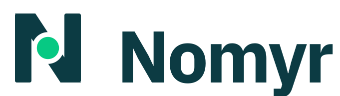

<div align="center">
  <picture>
    <source media="(prefers-color-scheme: dark)" srcset="brand/svg/nomyr-lockup-on-dark.svg">
    
  </picture>

  <h1>Open-source non-human identity security</h1>

  <p><strong>Every machine identity you have, and the human who answers for it.</strong></p>

  <p>
    <a href="https://nomyr.io"></a>
    <a href="https://github.com/nomyr-security/nomyr/actions/workflows/ci.yml"></a>
    <a href="LICENSE"></a>
    <a href="LICENSING.md"></a>
    <a href="https://nomyr.zulipchat.com/"></a>
  </p>

  <p>
    <a href="https://nomyr.io">Website</a> ·
    <a href="#product-scope">Product</a> ·
    <a href="#architecture">Architecture</a> ·
    <a href="CONTRIBUTING.md">Contributing</a> ·
    <a href="https://github.com/nomyr-security/nomyr/issues">Issues</a> ·
    <a href="SECURITY.md">Security</a>
  </p>
</div>

Nomyr is an **open-source, self-hostable non-human identity (NHI) security
platform** for service accounts, cloud roles, API keys, certificates, OAuth
applications, workload identities, automation, and AI agents.

It is being built as an open-source alternative to commercial NHI security
platforms such as Astrix Security and Oasis Security: a system teams can
inspect, self-host, extend, and operate inside their own security boundary.

Nomyr gives security, identity, and platform teams one place to discover machine
access, establish accountable ownership, understand effective reach, govern
risk, and carry identities from provisioning through verified retirement.

> Nomyr is independent of Astrix Security and Oasis Security and is not
> affiliated with or endorsed by either company. Their names and trademarks
> belong to their respective owners.

## Why Nomyr

Human IAM answers who an employee is. Secrets managers protect selected values.
Cloud IAM describes configured permissions. Those systems rarely answer the
whole machine-identity question:

- Which service accounts, keys, roles, certificates, workloads, integrations,
  MCP servers, and AI agents exist across the environment?
- Who is accountable for each identity, based on authoritative evidence?
- What can the identity actually reach, including multi-hop and delegated paths?
- Is access configured, observed, effective, inferred, or still unknown?
- Which credential can be rotated or retired without breaking its consumers?
- Did an approved remediation produce the intended result?

Nomyr is designed to connect those answers in an evidence-backed identity graph
instead of flattening inventory, posture, ownership, and activity into one
confidence score.

## Product scope

### Discover every machine identity

Build a unified inventory across cloud IAM, SaaS, CI/CD, Kubernetes, identity
providers, vaults, certificate authorities, code repositories, and on-premises
systems. Map identities to credentials, consumers, resources, permissions,
activity, and owners.

### Resolve ownership with evidence

Rank ownership candidates from authoritative sources such as service catalogs,
CODEOWNERS, deployment metadata, creation events, and approved attestations.
When evidence is insufficient, keep the identity explicitly unresolved.

### Measure posture and blast radius separately

Identify stale credentials, excessive privileges, exposed secrets, ownership
gaps, risky third-party access, and anomalous behavior. Keep severity, reach,
evidence quality, and coverage distinct so missing telemetry cannot look like
improved security.

### Govern the complete lifecycle

Coordinate provisioning, ownership, vaulting, federation, rotation, renewal,
access review, exception handling, and retirement. Track where a lifecycle is
blocked, who must decide, and what evidence is required to proceed.

### Secure workloads and AI agents

Apply scoped policies to workload identities, delegated access, agent sessions,
tools, and MCP servers. Support visibility first, human-approved remediation,
and explicitly authorized automation without silently widening execution scope.

### Verify remediation and preserve evidence

Connect findings to approved actions, verify the result against the original
intent, and retain replayable evidence for audit, incident response, and
compliance workflows.

## What makes Nomyr different

| Principle | Nomyr approach |
| --- | --- |
| **Open source and self-hostable** | Inspect the code, run it in your environment, and keep identity metadata and evidence under your control. |
| **Evidence before inference** | Show why Nomyr believes an owner, access path, or finding is valid. Preserve unresolved and unknown states. |
| **Contracts first** | Define public behavior in OpenAPI, protobuf, and JSON Schema before wiring implementations. |
| **Separated authority** | Keep user experience, control, secret custody, and action execution in distinct runtime planes. |
| **Human accountability** | Route consequential actions through explicit scope, policy, and approval instead of hiding responsibility inside automation. |
| **Verifiable outcomes** | Treat a completed action as a claim to verify, not automatic proof that risk was removed. |

## Architecture

Nomyr is designed as four physically separate runtime planes:

1. **Experience plane** — CLI, API, and web interfaces for people and tools.
2. **Control plane** — inventory, graph, policy, evidence, workflow, and audit
   coordination without reusable secret values.
3. **Custody plane** — isolated handling of reusable credentials and secret
   material.
4. **Action plane** — explicitly authorized execution close to the target
   environment.

The friendly `nomyr` binary does not link custody or action implementations.
Public contracts live under [`api/`](api/), [`proto/`](proto/), and
[`schemas/`](schemas/). Checked-in source and tests remain authoritative for
currently executable behavior.

## Run Nomyr locally

Requirements: the Go version declared in [`go.mod`](go.mod) and Node.js 22 with
npm.

```sh
git clone https://github.com/nomyr-security/nomyr.git
cd nomyr
make web-install
make test-fast
make build
./bin/nomyr demo
```

Open <http://127.0.0.1:8080>.

The local demo uses synthetic data and does not connect to providers or execute
security actions. Keep it bound to loopback; it does not provide authentication
or TLS. The repository is under active development, and capabilities are added
with their contracts, tests, and security boundaries rather than claimed ahead
of implementation.

Useful commands:

```sh
./bin/nomyr version
./bin/nomyr doctor
./bin/nomyr context
./bin/nomyr demo --listen 127.0.0.1:8080
```

Anonymous usage metrics are enabled by default. Run
`./bin/nomyr telemetry disable` to opt out and remove the local anonymous
installation ID, `./bin/nomyr telemetry status` to inspect the setting, or
`./bin/nomyr telemetry enable` to opt back in. See [TELEMETRY.md](TELEMETRY.md)
for the exact event fields and privacy limits.

## Repository map

| Path | Purpose |
| --- | --- |
| [`cmd/`](cmd/) | Nomyr CLI and runtime entrypoints |
| [`internal/`](internal/) | Internal Go implementation and runtime boundaries |
| [`web/`](web/) | Static Next.js web interface embedded into the Go build |
| [`api/`](api/) | Apache-2.0 public HTTP contracts |
| [`proto/`](proto/) | Apache-2.0 connector and action protocol definitions |
| [`schemas/`](schemas/) | Apache-2.0 JSON Schema contracts |
| [`sdk/`](sdk/) | Apache-2.0 SDK boundary |
| [`brand/`](brand/README.md) | Nomyr logos, icons, social images, and usage guidance |

## Community and contribution

Nomyr is built in the open. Contributions to code, contracts, integrations,
tests, documentation, accessibility, and security research are welcome.

- Read the [contribution guidelines](CONTRIBUTING.md).
- Open a structured [bug report or feature request](https://github.com/nomyr-security/nomyr/issues/new/choose).
- Join the [Nomyr community on Zulip](https://nomyr.zulipchat.com/).
- Follow the [Nomyr GitHub organization](https://github.com/nomyr-security).
- Visit [nomyr.io](https://nomyr.io) for the public project site.

Report vulnerabilities privately according to the
[security policy](SECURITY.md). Never post credentials, customer data, or private
infrastructure details in a public issue.

## Licensing

Nomyr core is licensed under
[GNU AGPL-3.0-only](LICENSE). SDKs and designated public API, protobuf, and JSON
Schema contracts are licensed under Apache-2.0. See
[`LICENSING.md`](LICENSING.md) for exact directory boundaries and third-party
notice requirements.

## Brand

The [Nomyr brand kit](brand/README.md) includes SVG masters, PNG exports,
favicons, social artwork, color tokens, and usage rules. Use the supplied
lockups instead of recreating the wordmark.
